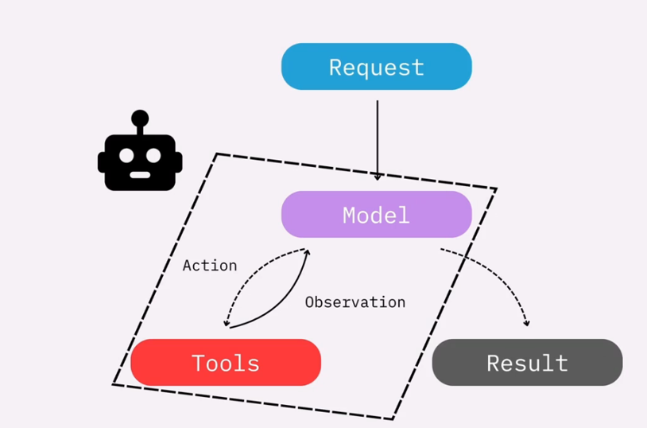
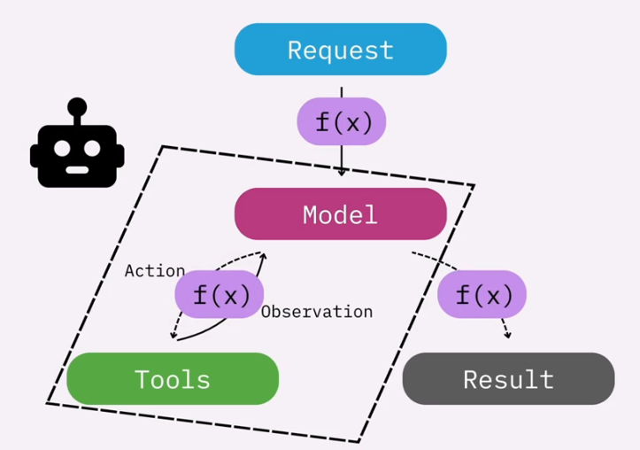

# 01 Middleware

In this module, we are going to level up our agents by introducing concepts that we can apply to deployment grade applications. Concepts such as _managing long conversations_, _human in the loop_, and _dynamically changing the behavior_ of our application based on runtime factors. To do all this, we'll be using **middleware**.

## What is middleware?

Let's look at our Agent (model & tool loop as shown below). This works fins as an _out-of-the-box_ agent, but is hard to customize beyond the model we choose, the prompts we set and the tools we give our Agent access to.

 
 

Middleware is really a _catch-all_ term for functions we insert within these loops, which allow us to control and customize our agent's execution. 

 
 

What this really means is _adding interventions_ _before_ and|or _after_ steps in the _out-of-box_ behavior of an Agent. For example, we can add function _before_ the model gets to process the request - this could modify the prompts going into the model for example. Similarly, we could add an intervention _after_ the model has generated the response but _before_ the user can see the final result. Example could be _filtering out_ inappropriate content generated by the model.

Here are some more practical examples of using middleware:

* Take for example a customer _payroll agent_, which we want to ensure _isn't_ providing _legal_ advise to users. We could build a custom _classifier_ (Legal or not-Legal) and insert it as custom middleware _after_ the agent does its run but _before_ the user sees the final response. Anything generated by the model that the classifier deems as _legal advise_ can be filtered out with a simple message like _"Sorry, I cannot respond to payroll related questions only!"_ to the user.
* Take another example of a _customer support agent_ that can process refunds. This might not be something that we want to do _without_ human oversite. In this case, we need to include a _human-in-the-loop_ intervention _after_ the agent makes the decision to disburse a certain refund amount, but _before_ the payout actual happen. Only if the human gives a _go-ahead_ should this request be processed.

So basically, Middleware is the key to level-up your hobby project to a production-ready agentic AI application.

## **TODO**
<< expand on this further with more code examples >>