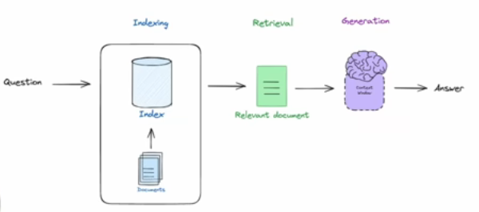
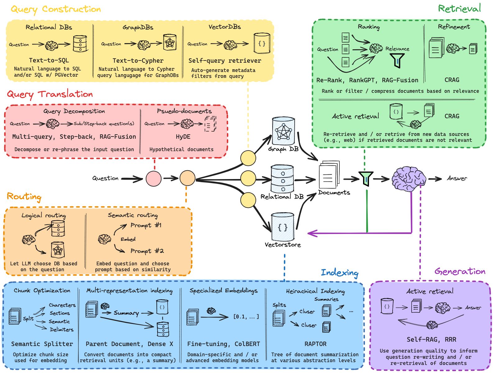

# RAG from Scratch
RAG of Retrieval Augmented Generation is one of the most popular applications in Generative AI. 

The motivation behind RAG is that most of the world's data is private, whereas LLMs are trained on publicly available data. So they can easily answer question on public data, such as "Tell me about Sachin Tendulkar". However they have no knowledge about your private/confidential data, such as your business proposals to customer X. So an LLM will struggle to answer a question such as "what type of staffing model did we propose to customer X for their Insurance UW proposal?".

Also LLM's have a _training cutoff_, meaning they are trained with data upto a certain data, such as Sept 2023. It will therefore struggle to answer questions on more recent events too - such as "Who won the ICC T20 mens trophy in 2025?"

What's really interesting with modern LLMs, such as Google Gemini Flash or Anthropic Claude or OpenAI GPT is the size of the context window (or the ability to feed data _into_ these models) is getting larger and larger (From 4-8K tokens (~12 pages of text) to ~1 Mn tokens, which is approximately 1000 of pages of text!). This is making it increasingly feasible to feed them huge mass of external private data to an LLM - something it has never seen; could be your own corporate data for example (or any other information not in its native training set) - and the LLM can answer question off that data. This is the main motivation around RAG. 

This is the motivation behind RAG:
1. LLMs at the center of a new kind of operating mechanism.
2. It's extremely critical to be able to feed in external information to LLM for processing.

You can think of RAG as 3 very general steps as shown in the figure below:

1. There is the process of _Indexing_ of external data. You can think about this as building a database of sorts. Many companies already have large database in various forms - RDBMs, NoSQL DBs, vector stores or otherwise. 
2. The point is that documents are indexed such that they can be retrived based on some huristics relative to an input, like a question (_Retrieval_).
3. Those documents can then be passed to an LLM (as a context), which can produced answers that can be grounded in that context (_Generation_). 

This is the central idea behind RAG and why it is such a powerful technology - it _unites_ the analysis capability of LLMs with large provate sources of data.

However, RAG is much more involved that the _simple_ process illustrated above. In this set of notebooks, we'll cover all the finer aspects of RAG as shown in the image below:

It consists of a few different sections. Going from left-to-right, we have:
1. **Query Translation**: captures a bunch of various methods, which take a question from the user and modify it to make it better suited for retrieval from one of the indexes. One such technique is _decomposition_ which creates multiple sub-questions from a single user query. 
2. **Routing**: encompasses techniques to take the decomposed/re-written question and route it to the correct data store (such as vector db, graph db or an RDBMS for example) - get the question to the right source.
3. **Query Construction**: this is basically taking query in natural language and converting it into the DSL necessary for whatever data source you want to work with. A classic example would be _text-to-SQL_, which is converting natural language into a SQL query based on the underlying RDBMS' data structure. Another one is _text-to-cipher_ for use with a GraphDB such as Neo4j. _Text-to-metadata-filters_ for vector dbs is yet another technique.
4. **Indexing**: This is the process of taking your documents and processing them in such a way that they can be easily retrieved. There are a bunch of techniques, such as various embedding methods, and various indexing strategies.
5. **Retrieval**: After retrieval, there are different techniques to _re-rank_ or _filter_ retrieved documents.
6. **Generation**: which consists of an interesting new set of methods to do what we might call as _active RAG_, which are techiques to grade documents, grade answers, grade for relevance of the question, grade for faithfulness to the documents (i.e. check for hallucinations), and if either fail feedback, re-retrieve or re-write the question, re-generate the answer and so forth.

Here are the set of applicable notebooks:
1. [01-Indexing Retrieval Generation](01-Indexing_Retrieval_Generation.ipynb) : bare-bones or naive RAG technique.
2. [02-Query Transformations](02-Query_Transformations.ipynb)
3. [03-Routing](03-Routing.ipynb)
4. [04-Query Construction](04-Query_Construction.ipynb)
5. [05-Indexing](05-Indexing.ipynb)
6. [06-Retrieval](06-Retrival.ipynb)
7. [07-Generation](07-Generation.ipynb)